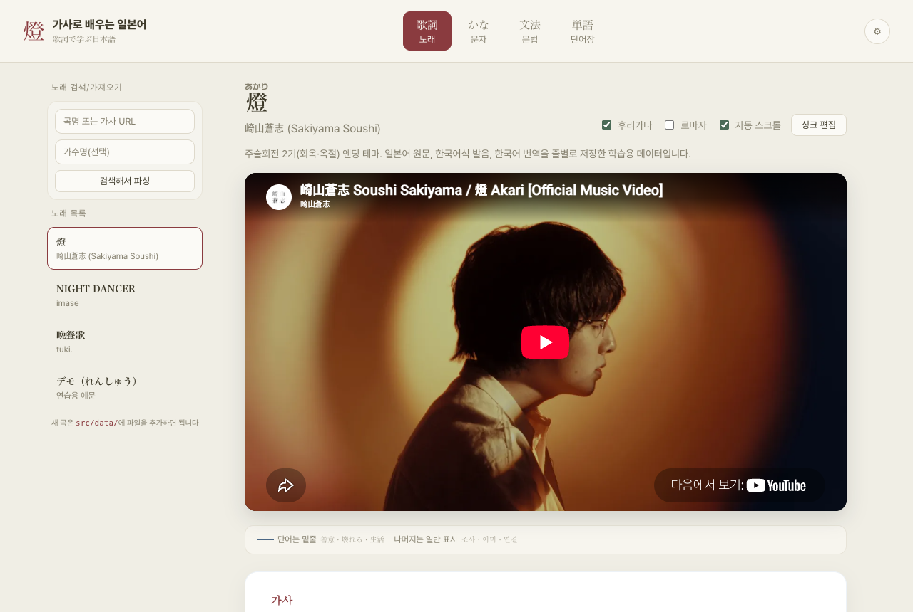
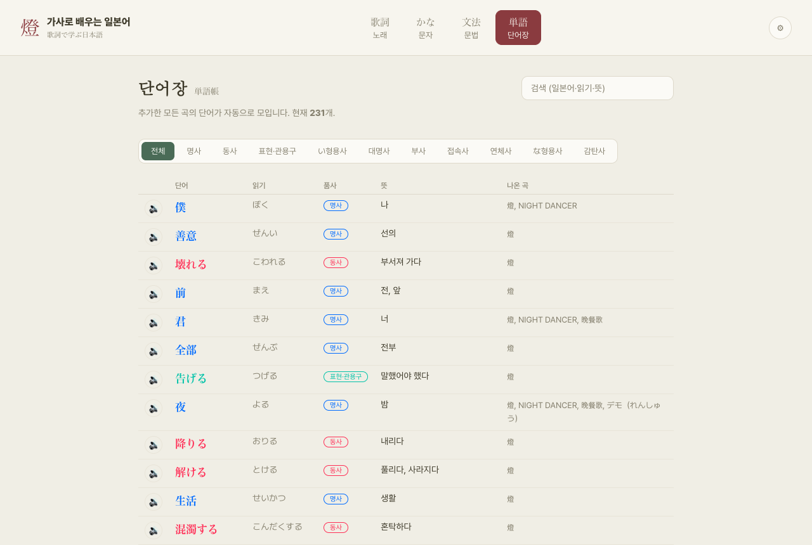
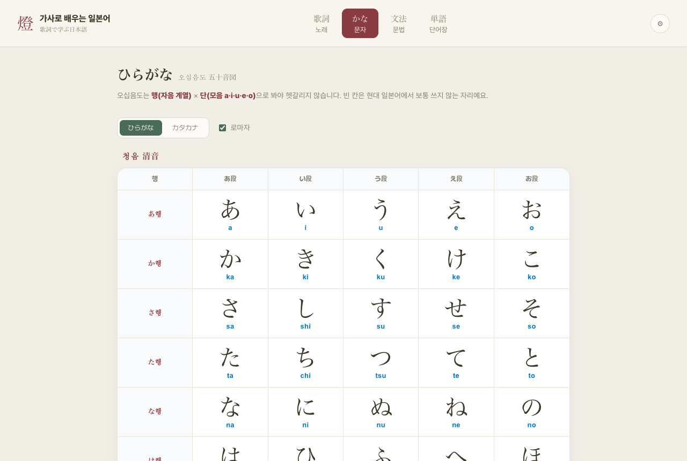
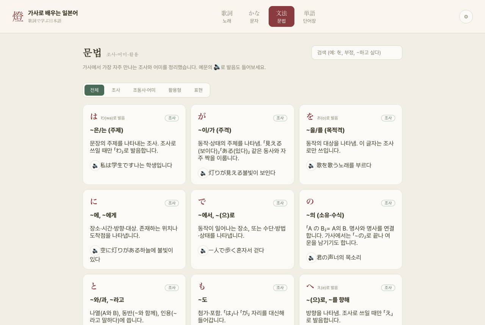

# 燈 가사로 배우는 일본어

좋아하는 J-POP 노래 가사로 일본어를 배우는 학습용 웹앱입니다. 노래를 들으면서 가사를 따라가고, 후리가나·발음·번역·문법을 한 줄씩 확인할 수 있어요.

- **스택**: React 19 + TypeScript + Vite
- **배포**: Vercel (아래 [배포](#배포) 참고)

## 목차

- [주요 기능](#주요-기능)
- [화면](#화면)
- [시작하기](#시작하기)
- [새 곡 추가하기](#새-곡-추가하기)
- [프로젝트 구조](#프로젝트-구조)
- [배포](#배포)

## 주요 기능

### 🎵 노래 (가사 학습)

- 공식 YouTube 뮤직비디오를 가사 위에 바로 embed — 들으면서 화면으로 같이 볼 수 있어요
- 가사 줄마다 **후리가나 · 한국어식 발음(로마자 아님, 한글) · 한국어 번역**을 동시에 표시
- 단어 위에 마우스를 올리면(또는 탭하면) 품사별 색상 + 뜻 툴팁
- **카라오케 자동 하이라이트 / 자동 스크롤**: 영상 재생 위치에 맞춰 현재 줄이 하이라이트되고 화면이 따라 스크롤됩니다
- **싱크 편집 모드**: 노래를 재생하며 각 줄이 시작하는 순간 `Enter`를 누르면 타임스탬프가 찍히고, 그 결과가 즉시 하이라이트/스크롤에 반영됩니다 (브라우저 localStorage에 곡별로 저장)
- 줄을 클릭하면 그 지점부터 재생 + 단어 테이블 + 문법 포인트를 확인

### か 문자 (오십음도)

히라가나/가타카나 오십음도표. 로마자 표기와 발음 듣기 지원.

### 文法 문법

가사에 등장한 조사·어미·활용형을 모아 정리한 문법 사전. 검색 가능.

### 単語 단어장

추가한 모든 곡에서 등장한 단어가 자동으로 모여 사전처럼 쌓입니다. 품사별 필터, 검색, 발음 듣기 지원.

### ⚙ 설정

헤더 오른쪽 톱니바퀴 아이콘에서 **글자 크기**와 **본문 여백 너비**를 조절할 수 있어요. 값은 브라우저에 저장되어 다음 방문 때도 유지됩니다.

## 화면

|                                                    |                                                          |
| -------------------------------------------------- | -------------------------------------------------------- |
|  |  |
| **노래**: 영상 + 후리가나 가사 + 한국어식 발음 + 번역               | **설정**: 글자 크기 · 여백 너비 조절                              |
|               |               |
| **단어장**: 전 곡에서 자동 수집된 단어 사전                       | **문자**: 히라가나/가타카나 오십음도                                |
|              |                                                            |
| **문법**: 조사·어미·활용 정리                               |                                                            |

## 시작하기

```bash
npm install
npm run dev       # http://localhost:5173
```

```bash
npm run build      # tsc -b && vite build → dist/
npm run preview    # 빌드 결과 로컬 미리보기
npm run lint        # oxlint
```

## 새 곡 추가하기

1. `src/data/<곡id>.ts` 파일을 만들고 `Song` 타입([src/types.ts](src/types.ts))에 맞춰 데이터를 작성합니다. 저작권 때문에 가사 원문은 이 저장소에 미리 채워두지 않고, 직접 확보한 가사를 붙여넣어 사용하세요.

   ```ts
   import type { Song } from '../types';

   export const mySong: Song = {
     id: 'my-song',
     title: '曲名',
     artist: '아티스트',
     youtubeId: 'xxxxxxxxxxx', // 공식 MV의 YouTube 영상 ID
     sections: [
       {
         name: '1절',
         lines: [
           {
             jp: '日本語の歌詞',
             reading: '니혼고노 카시', // 한국어식 발음
             ko: '일본어 가사',       // 한국어 번역
             tokens: [
               { surface: '日本語', reading: 'にほんご', pos: 'noun', meaning: '일본어' },
               { surface: 'の', pos: 'particle', meaning: '~의' },
               { surface: '歌詞', reading: 'かし', pos: 'noun', meaning: '가사' },
             ],
           },
         ],
       },
     ],
   };
   ```

   - `tokens[].surface`를 모두 이어붙이면 그 줄의 `jp` 문자열과 정확히 일치해야 합니다.
   - 활용된 동사/형용사는 `base`(기본형)·`baseReading`을 채워주면 단어장에서 기본형으로 묶여 표시됩니다.
   - 로컬 소장 음원을 쓰려면 `public/audio/`에 파일을 넣고 `audioFile` 필드를 사용하세요 (`youtubeId` 대신).

2. `src/data/index.ts`의 `songs` 배열에 추가합니다.

3. (선택) 노래를 들으며 「싱크 편집」 버튼으로 줄별 타임스탬프를 찍고, JSON 복사 버튼으로 내보낸 값을 각 줄의 `start` 필드에 채워 넣으면 다음에도 하이라이트 타이밍이 유지됩니다.

## 프로젝트 구조

```
src/
  pages/
    SongsPage.tsx     노래(가사 학습) 탭 — 플레이어, 싱크, 카라오케
    KanaPage.tsx       오십음도
    GrammarPage.tsx    문법 사전
    VocabPage.tsx      단어장 (전 곡 자동 수집)
  components/
    Player.tsx         YouTube / 로컬 오디오 재생기
    SettingsPanel.tsx   글자 크기 · 여백 너비 설정 팝오버
  data/
    <곡id>.ts          곡별 가사 데이터
    index.ts            등록된 곡 목록
    grammar.ts          문법 사전 데이터
    kana.ts             오십음도 데이터
  settings.ts           전역 설정 상태(localStorage 연동)
  types.ts               Song / Line / Token 등 타입 정의
  romaji.ts, speak.ts     로마자 변환, 브라우저 TTS 발음
```

## 배포

[Vercel](https://vercel.com)에 연결되어 있습니다. **Vercel 프로젝트 설정(Settings → Git)에서 이 GitHub 저장소가 연결되어 있다면** `main` 브랜치에 푸시할 때마다 자동으로 재배포됩니다. CLI로 연결만 해두고 GitHub 연동은 안 되어 있는 경우 자동 배포가 되지 않으니, Vercel 대시보드에서 프로젝트 → Settings → Git → **Connect Git Repository**로 이 저장소를 연결해주세요. 수동 배포는 `vercel --prod`로도 가능합니다.
